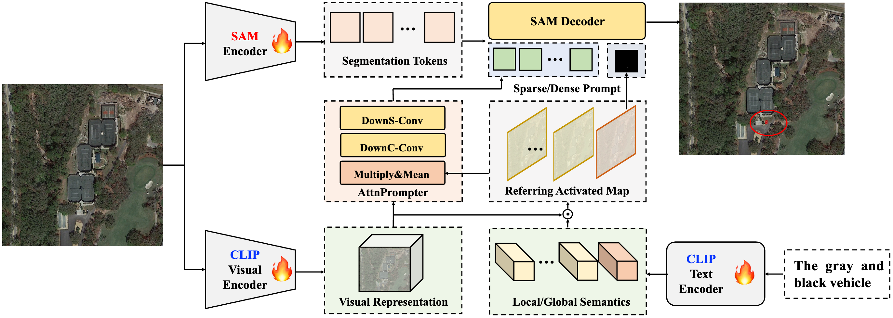

<div align="center">
    <h2>
        RSRefSeg: Referring Remote Sensing Image Segmentation with Foundation Models
    </h2>
</div>
<br>

<div align="center">
  
</div>
<br>
<div align="center">
  <a href="https://github.com/KyanChen/RSRefSeg">
    <span style="font-size: 20px; ">项目主页</span>
  </a>
  &nbsp;&nbsp;&nbsp;&nbsp;
  <a href="https://arxiv.org/abs/xxxx">
    <span style="font-size: 20px; ">arXiv</span>
  </a>
  &nbsp;&nbsp;&nbsp;&nbsp;
  <a href="resources/RSRefSeg.pdf">
    <span style="font-size: 20px; ">PDF</span>
  </a>
</div>
<br>
<br>

[](https://github.com/KyanChen/RSRefSeg)
[](LICENSE)
[](https://arxiv.org/abs/2403.xxx)

<br>
<br>

<div align="center">

[English](README.md) | 简体中文

</div>


## 简介

本项目仓库是论文 [RSRefSeg: Referring Remote Sensing Image Segmentation with Foundation Models](https://arxiv.org/abs/2403.xxx) 的代码实现，基于 [MMSegmentation](https://github.com/open-mmlab/mmsegmentation) 项目进行开发。

当前分支在 Linux 系统，PyTorch 2.x 和 CUDA 12.1 下测试通过，支持 Python 3.10+，能兼容绝大多数的 CUDA 版本。

如果你觉得本项目对你有帮助，请给我们一个 star ⭐️，你的支持是我们最大的动力。

<details open>
<summary>主要特性</summary>

- 与 MMSegmentation 高度保持一致的 API 接口及使用方法
- 开源了论文中不同版本大小的 RSRefSeg 模型
- 支持了多种数据集的训练和测试

</details>

## 更新日志

🌟 **2025.01.12** 发布了 RSRefSeg 项目，完全与 MMSegmentation 保持一致的API接口及使用方法。


## 目录

- [简介](#简介)
- [更新日志](#更新日志)
- [目录](#目录)
- [安装](#安装)
- [数据集准备](#数据集准备)
- [模型训练](#模型训练)
- [模型测试](#模型测试)
- [图像预测](#图像预测)
- [常见问题](#常见问题)
- [致谢](#致谢)
- [引用](#引用)
- [开源许可证](#开源许可证)
- [联系我们](#联系我们)

## 安装

### 依赖项

- Linux 系统， Windows 也可运行
- Python 3.10+，推荐使用 3.11
- PyTorch 2.0 或更高版本，推荐使用 2.4
- CUDA 11.7 或更高版本，推荐使用 12.1
- MMCV 2.0 或更高版本，推荐使用 2.2

### 环境安装

推荐使用 Miniconda 来进行安装，以下命令将会创建一个名为 `rsrefseg` 的虚拟环境，并安装 PyTorch 和 MMCV。下述安装步骤中，默认安装的 CUDA 版本为 **12.1**，如果你的 CUDA 版本不是 12.1，请根据实际情况进行修改。

注解：如果你对 PyTorch 有经验并且已经安装了它，你可以直接跳转到下一小节。否则，你可以按照下述步骤进行准备。

<details open>

**步骤 0**：安装 [Miniconda](https://docs.anaconda.com/miniconda/install/#quick-command-line-install)。

**步骤 1**：创建一个名为 `rsmamba` 的虚拟环境，并激活它。

```shell
conda create -n rsrefseg python=3.11 -y
conda activate rsrefseg
```

**步骤 2**：安装 [PyTorch2.4.x](https://pytorch.org/get-started/previous-versions/)。

Linux/Windows:

```shell
pip install torch==2.4.1 torchvision==0.19.1 torchaudio==2.4.1 --index-url https://download.pytorch.org/whl/cu121
```
或者
```shell
conda install pytorch==2.4.1 torchvision==0.19.1 torchaudio==2.4.1 pytorch-cuda=12.1 -c pytorch -c nvidia
```

**步骤 3**：安装 [MMCV2.1.x](https://mmcv.readthedocs.io/en/latest/get_started/installation.html)。

```shell
pip install -U openmim
mim install mmcv==2.2.0
#或者
pip install mmcv==2.2.0 -f https://download.openmmlab.com/mmcv/dist/cu121/torch2.4/index.html
```

**步骤 4**：安装其他依赖项。

```shell
pip install modelindex ipdb ms-swift transformers peft modelscope accelerate qwen_vl_utils pycocotools -U
```

</details>


### 安装 RSRefSeg


下载或克隆 RSRefSeg 仓库即可。

```shell
git clone git@github.com:KyanChen/RSRefSeg.git
cd RSRefSeg
```

## 数据集准备

<details open>

### 遥感图像指代分割数据集

我们提供论文中使用的遥感图像指代分割数据集的准备方法。

#### RRSIS-D 数据集

- 图片及标注下载地址：[RRSIS-D 数据集](https://github.com/Lsan2401/RMSIN#Datasets)。


#### 组织方式

你也可以选择其他来源进行数据的下载，但是需要将数据集组织成如下的格式：

```
${DATASET_ROOT} # 数据集根目录，例如：/home/username/data
├── rrsisd
│   ├── refs(unc).p
│   └── instances.json
├── images
    └── rrsisd
        ├── JPEGImages
        └── ann_split
```

#### 数据集转换

我们提供一个脚本来将数据集转换为我们需要的格式，并生成 JSONL 文件。

注解：在项目文件夹 `datainfo` 中，我们已经提供了转换好的JSONL文件，你可以直接使用。同时，我们也提供了一个 [Python 脚本](tools_RSRefSeg/convert_data_to_jsonl.py) 来转换数据集。


### 其他数据集

如果你想使用其他数据集，可以参考该 [Python 脚本](tools_RSRefSeg/convert_data_to_jsonl.py) 来进行数据集的准备。

</details>

## 模型训练

### RSRefSeg 模型

#### Config 文件及主要参数解析

我们提供了论文中不同参数大小的 RSRefSeg 模型的配置文件，你可以在 [配置文件](configs_RSRefSeg) 文件夹中找到它们。Config 文件完全与 MMSegmentation 保持一致的 API 接口及使用方法。下面我们提供了一些主要参数的解析。如果你想了解更多参数的含义，可以参考 [MMSegmentation 文档](https://mmsegmentation.readthedocs.io/zh-cn/latest/user_guides/1_config.html)。

<details>

**参数解析**：

- `work_dir`：模型训练的输出路径，一般不需要修改。
- `data_root`：数据集根目录，**修改为数据集根目录的绝对路径**。
- `batch_size`：单卡的 batch size，**需要根据显存大小进行修改**。
- `max_epochs`：最大训练轮数，一般不需要修改。
- `val_interval`：验证集的间隔轮数，一般不需要修改。
- `vis_backends/WandbVisBackend`：网络端可视化工具的配置，**打开注释后，需要在 `wandb` 官网上注册账号，可以在网络浏览器中查看训练过程中的可视化结果**。
- `resume`: 是否断点续训，一般不需要修改。
- `load_from`：模型的预训练的检查点路径，一般不需要修改。
- `init_from`：模型的预训练的检查点路径，一般保持为None，除非需要断点续训，则需要修改为对应的检查点路径。
- `default_hooks/CheckpointHook`：模型训练过程中的检查点保存配置，一般不需要修改。
- `model/lora_cfg`：模型高效微调的配置，一般不需要修改。
- `model/backbone`：SAM模型的视觉骨干，**需要根据实际情况进行修改**，base对应 `sam-vit-base`, large对应 `sam-vit-large`, huge对应 `sam-vit-huge`。
- `model/clip_vision_encoder`：CLIP模型的视觉编码器，一般不需要修改。
- `model/clip_text_encoder`：CLIP模型的文本编码器，一般不需要修改。
- `model/sam_prompt_encoder`：SAM模型的提示编码器，一般不需要修改。
- `model/sam_mask_decoder`：SAM模型的解码器，一般不需要修改。
- `model/decode_head`：RSRefSeg模型的伪解码头，一般不需要修改。
- `AMP training config`：混合精度训练的配置，如果不使用DeepSpeed训练，则打开注释，一般不需要修改。
- `DeepSpeed training config`：DeepSpeed训练的配置，如果使用DeepSpeed训练，则打开注释，将`AMP training config`注释掉，注意Windows系统不支持DeepSpeed训练。
- `dataset_type`：数据集的类型，一般不需要修改。
- `data_preprocessor/mean/std`：数据预处理的均值和标准差，一般不需要修改。

</details>


#### 单卡训练

```shell
python tools/train.py configs_RSRefSeg/name_to_config.py  # name_to_config.py 为你想要使用的配置文件
```

#### 多卡训练

```shell
sh tools/dist_train.sh configs_RSRefSeg/name_to_config.py ${GPU_NUM}  # name_to_config.py 为你想要使用的配置文件，GPU_NUM 为使用的 GPU 数量
```


## 模型测试

#### 单卡测试：

```shell
python tools/test.py configs_RSRefSeg/name_to_config.py ${CHECKPOINT_FILE}  # name_to_config.py 为你想要使用的配置文件，CHECKPOINT_FILE 为你想要使用的检查点文件
```

#### 多卡测试：

```shell
sh tools/dist_test.sh configs_RSRefSeg/name_to_config.py ${CHECKPOINT_FILE} ${GPU_NUM}  # name_to_config.py 为你想要使用的配置文件，CHECKPOINT_FILE 为你想要使用的检查点文件，GPU_NUM 为使用的 GPU 数量
```


## 图像预测

#### 单张图像预测：

```shell
python demo/image_demo.py ${IMAGE_FILE}  configs_RSRefSeg/name_to_config.py --checkpoint ${CHECKPOINT_FILE} --show-dir ${OUTPUT_DIR}  # IMAGE_FILE 为你想要预测的图像文件，name_to_config.py 为你想要使用的配置文件，CHECKPOINT_FILE 为你想要使用的检查点文件，OUTPUT_DIR 为预测结果的输出路径
```

#### 多张图像预测：

```shell
python demo/image_demo.py ${IMAGE_DIR}  configs_RSRefSeg/name_to_config.py --checkpoint ${CHECKPOINT_FILE} --show-dir ${OUTPUT_DIR}  # IMAGE_DIR 为你想要预测的图像文件夹，name_to_config.py 为你想要使用的配置文件，CHECKPOINT_FILE 为你想要使用的检查点文件，OUTPUT_DIR 为预测结果的输出路径
```


## 常见问题

<details open>

我们在这里列出了使用时的一些常见问题及其相应的解决方案。如果您发现有一些问题被遗漏，请随时提 PR 丰富这个列表。如果您无法在此获得帮助，请使用[issue](https://github.com/KyanChen/RSRefSeg/issues)来寻求帮助。请在模板中填写所有必填信息，这有助于我们更快定位问题。

### 1. 是否需要安装MMSegmentation？

我们建议您不要安装MMSegmentation，因为我们已经对MMSegmentation的代码进行了部分修改，如果您安装了MMSegmentation，可能会导致代码运行出错。如果你出现了模块尚未被注册的错误，请检查：

- 该模块是否是一个需要安装的包，若是则安装
- 是否安装了MMSegmentation，若有则卸载
- 是否在类名前加上了`@MODELS.register_module()`，若没有则加上
- 是否在`__init__.py`中加入了`from .xxx import xxx`，若没有则加上
- 是否在Config文件中加入了`custom_imports = dict(imports=['rsris'], allow_failed_imports=False)`，若没有则加上


### 2. dist_train.sh: Bad substitution的解决

如果您在运行`dist_train.sh`时出现了`Bad substitution`的错误，请使用`bash dist_train.sh`来运行脚本。


</details>

## 致谢

本项目基于 [MMSegmentation](https://github.com/open-mmlab/mmsegmentation) 进行开发，感谢 MMSegmentation 项目的开发者们。

## 引用

如果你在研究中使用了本项目的代码或者性能基准，请参考如下 bibtex 引用 RSRefSeg。

```
@article{chen2025rsrefseg,
  title={RSRefSeg: Referring Remote Sensing Image Segmentation with Foundation Models},
  author={Chen, Keyan and Zhang, Jiafan and Liu, Chenyang and Zou, Zhengxia and Shi, Zhenwei},
  journal={arXiv preprint arXiv:2501.xxxx},
  year={2025}
}
```

## 开源许可证

该项目采用 [Apache 2.0 开源许可证](LICENSE)。

## 联系我们

如果有其他问题❓，请及时与我们联系 👬